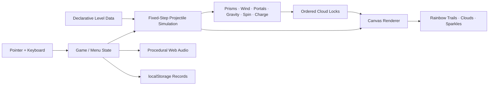

# 🦄🌈 uniRico

<p align="center">
  
</p>

<p align="center">
  <strong>A 13KB rainbow-ricochet puzzle game about a magical unicorn, grumpy storm clouds, and fixing the sky one impossible shot at a time.</strong>
</p>

<p align="center">
  <strong>THE SKY GOT GRUMPY · YOU HAVE A HORN · FIX IT</strong>
</p>

<p align="center">
  Built for <strong>js13kGames 2026</strong> · Theme: <strong>Unicorns and Rainbows</strong> · Target category: <strong>Desktop</strong>
</p>

---

## ✨ What is uniRico?

**uniRico** is a compact HTML5 Canvas puzzle game where you aim a unicorn's horn and fire a fading rainbow projectile through a magical sky.

The shot can ricochet from prisms, pass through rainbow arches, bend in wind, curve around moonbow gravity fields, pick up spin or charge, and interact with other magical effects. Each level contains **angry gray storm clouds** that must be reached in the correct order and with the correct number of bounces. Hit them correctly and the rainbow cheers them up, turning them into happy white clouds.

The entire fantasy can be explained in one line:

> **Aim horn → fire rainbow → bend the trajectory → cheer up the clouds.**

The presentation is intentionally cute. The puzzle system underneath it is not. Later levels combine moving geometry, timing windows, portals, continuous forces, and exact reflection counts into long-form trajectory problems.

---

## 🎮 The play loop

1. **Aim the horn** with the mouse or pointer.
2. **Read the white trajectory preview** and the moving sky systems.
3. **Fire the rainbow** and commit to the shot.
4. **Ricochet through prisms, arches, wind, gravity, spin, and magic.**
5. **Reach each grumpy cloud with exactly the required bounce count.**
6. **Turn it happy** and continue the chain until the sky is restored.

A successful shot is both the solution and the spectacle: the projectile leaves a fading multi-band rainbow ribbon across the level.

---

## 🌈 Current release

### v0.3.0

The current game includes:

- **40 handcrafted puzzle levels**
- procedural unicorn launcher drawn entirely with Canvas
- six-band rainbow projectile with a fading ribbon tail
- angry storm-cloud targets that become happy when cleared
- exact-bounce lock logic
- moving targets and moving reflectors
- rainbow-arch portals
- wind / cloud gust fields
- dream-cloud slow zones
- stardust acceleration zones
- moonbow gravity fields
- spin and magnetic charge mechanics
- pulsing storm barriers
- aurora resonance gates
- procedural particles, sparkles, clouds, rainbows, and audio
- local best scores, stars, shots, and completion records
- level select
- built-in help tools: **Show Aim**, **Watch Mirrored Shot**, and **Watch Solution**
- no external runtime libraries or downloaded game assets

The competition runtime remains a single self-contained `index.html`.

---

## 🕹 Controls

| Input | Action |
|---|---|
| Mouse / pointer | Aim the unicorn horn |
| Click / tap | Fire the rainbow |
| `M` / `Esc` | Pause / menu |
| `R` | Restart level |
| `H` | Help |
| `P` | Toggle trajectory preview |
| `S` | Toggle sound |
| `[` / `]` | Previous / next level during development/testing |
| `Space` / `Enter` | Continue after level completion |

---

## ☁️ A game language built around the theme

The goal was not to put a unicorn sprite on top of an unrelated physics game. The mechanics themselves are translated into one coherent sky-magic vocabulary.

| Gameplay function | uniRico presentation |
|---|---|
| Launcher | Unicorn + glowing horn |
| Projectile | Fading six-band rainbow |
| Targets | Grumpy storm clouds → happy clouds |
| Reflectors | Rainbow-edged prisms |
| Portals | Rainbow arches |
| Wind | Cloud gusts / magical air currents |
| Slow fields | Dream clouds |
| Acceleration | Stardust / sunburst magic |
| Gravity | Moonbow fields |
| Spin | Swirling unicorn magic |
| Charge / polarity | Magical charge fields |
| Timed barriers | Storm walls / lightning |
| Resonance | Aurora gates |
| Failure hazards | Dark storm-cloud / night-sky hazards |
| Prediction | Bright white dotted trajectory |
| Committed shot | Rainbow ribbon |
| Learned solution | Faint solution trace |

This matters because the theme becomes part of how players read the puzzle rather than decoration layered on after the fact.

---

## 🧠 Puzzle design

Every cloud target encodes a required bounce count. The shot must reach the active cloud with **exactly** that number of reflections before the ordered sequence can advance.

The campaign then composes that rule with different systems:

- **moving geometry** asks the player to solve where an object *will be*, not where it is now;
- **wind and gravity** convert straight-line aiming into continuous trajectory shaping;
- **spin and polarity** create persistent state carried across the shot;
- **portals** break local spatial intuition and create long routes;
- **timed barriers and resonance gates** make arrival time and speed part of the solution;
- **reduced preview distance** in later levels asks the player to reason beyond what the guide explicitly shows.

The intention is a difficulty curve that starts visually obvious and ends with compact little machines that the player learns to read.

---

## 🔍 Readable source vs. competition build

js13kGames is fundamentally about the tiny shipped package, but the public repository should still be useful to people who want to learn from the implementation.

This repository therefore exposes **two views of the same game**:

### 1. `index.html` — competition-oriented runtime

The single-file build keeps HTML, CSS, JavaScript, level data, rendering, audio, and UI together so it can be compressed efficiently for the 13KB archive.

### 2. `src/` — readable development mirror

The same v0.3.0 code has been split into inspectable files:

```text
src/
├── index.html    # readable development shell
├── style.css     # HUD / page styling
├── levels.js     # field rigs + all 40 level definitions
├── game.js       # formatted runtime, simulation, rendering, UI, audio
└── README.md     # how the readable mirror maps to the tiny build
```

The readable mirror intentionally preserves compact runtime identifiers where changing them would make comparison with the shipping artifact harder. **`docs/SOURCE_GUIDE.md` provides the descriptive symbol map** and explains what the compact functions and level keys mean.

Recommended reading order:

1. [`README.md`](README.md)
2. [`docs/SOURCE_GUIDE.md`](docs/SOURCE_GUIDE.md)
3. [`docs/ARCHITECTURE.md`](docs/ARCHITECTURE.md)
4. [`src/levels.js`](src/levels.js)
5. [`src/game.js`](src/game.js)
6. [`index.html`](index.html) when you want to see the byte-conscious shipped form

---

## 🗂 Repository layout

```text
uniRico/
├── index.html                         # Complete playable v0.3.0 runtime
├── README.md                          # Project showcase + entry point
├── CHANGELOG.md                       # Release history
├── .gitignore
├── src/
│   ├── README.md                      # Readable-source notes
│   ├── index.html                     # Development shell
│   ├── style.css                      # Extracted readable CSS
│   ├── levels.js                      # Campaign + reusable rigs
│   └── game.js                        # Formatted runtime source
└── docs/
    ├── banner.svg                     # README cover banner
    ├── SOURCE_GUIDE.md                # Symbol map + reading guide
    ├── ARCHITECTURE.md                # Systems / engine walkthrough
    └── COMPETITION_CHECKLIST.md       # Release and submission gate
```

---

## 🧬 Architecture at a glance



Key implementation choices:

- **960 × 600 logical world** scaled to the browser window
- **fixed simulation steps** independent of rendering cadence
- **one simulation path** shared by live projectile and trajectory prediction
- **declarative level objects** with missing mechanic arrays meaning “not present”
- **shared field rigs** reused by advanced levels to save bytes
- **procedural Canvas visuals** instead of sprite assets
- **procedural Web Audio** instead of audio files
- **packed solution data** for hints and demonstrations

For the deep dive, see [`docs/ARCHITECTURE.md`](docs/ARCHITECTURE.md).

---

## 🧩 Compact level format

A level is a small object with a few common keys:

| Key | Meaning |
|---|---|
| `n` | level name |
| `p` | unicorn start position |
| `t` | ordered cloud targets |
| `m` | reflection limit |
| `q` | trajectory-preview simulation budget |
| `w` | reflective walls / prisms |
| `o` | rainbow-arch portals |
| `f` | wind fields |
| `z` | dream-cloud slow zones |
| `a` | accelerator zones |
| `g` | gravity / moonbow fields |
| `s` | spin fields |
| `c` | charge zones |
| `k` | polarity / magnetic fields |
| `b` | timed storm barriers |
| `r` | resonance gates |
| `v` | hazards |

A target uses the compact tuple:

```text
[x, y, requiredBounces, motionMode, amplitude, speed, phase, radius]
```

Later levels spread reusable `F0...F9` rigs into the level object. This is one of the main ways the campaign gets mechanically dense without paying to restate the same environment data over and over.

---

## 🚀 Running locally

### Competition-style build

No install step is required. Open:

```text
index.html
```

or serve the repository:

```bash
python3 -m http.server 8000
```

then open `http://localhost:8000`.

### Readable development mirror

Serve the repository and open:

```text
http://localhost:8000/src/
```

The `src/` version loads `levels.js`, `game.js`, and `style.css` separately so the implementation is easier to inspect in browser developer tools.

---

## 📦 js13kGames size target

The standard js13kGames archive ceiling is **13 KiB = 13,312 bytes**.

The locally frozen v0.3.0 competition archive currently measures:

```text
13,155 bytes
157 bytes remaining
SHA-256: 1588b481c786939a99dd360409b42eb425889cec1b04fc52ba66acf7b9c5264e
```

The exact submission ZIP is deliberately kept separate from the readable repository tree. When the final Desktop candidate is frozen, it should be attached to a tagged release so the repository commit, ZIP artifact, byte count, and hash form one reproducible checkpoint.

See [`docs/COMPETITION_CHECKLIST.md`](docs/COMPETITION_CHECKLIST.md).

---

## 🧪 Release gate

Before a competition build is frozen, the candidate should pass:

1. exact ZIP byte-count check
2. `index.html` at archive root
3. offline / no-external-runtime-resource check
4. latest Chrome smoke test
5. latest Firefox smoke test
6. zero console errors
7. early-, middle-, and late-campaign gameplay checks
8. pause / Help / Levels / Restart checks
9. solution playback check
10. local record persistence check
11. resize and multiple desktop aspect-ratio checks
12. SHA-256 freeze of the exact submitted archive
13. public readable-source review

The expanded checklist lives in [`docs/COMPETITION_CHECKLIST.md`](docs/COMPETITION_CHECKLIST.md).

---

## 🎨 Visual design principles

uniRico aims for **cute clarity rather than decorative overload**:

- a darker twilight-blue playfield keeps white trajectory lines readable;
- pale cloud-shaped HUD panels separate information from the arena;
- rainbow saturation is reserved for motion, interaction, and success;
- grumpy gray clouds communicate unresolved objectives immediately;
- happy white clouds make restoration emotionally obvious;
- environmental systems remain visually distinguishable even when several overlap;
- menus use conventional words such as **Levels**, **Help**, and **Restart Level** even when the world itself is whimsical.

The player should be solving the puzzle, not solving the interface.

---

## 🛣 Development direction

Current priorities are:

- keep the rainbow ricochet readable and satisfying;
- make every mechanic feel native to unicorn / rainbow / sky magic;
- teach bounce-count logic with minimal text;
- preserve meaningful difficulty instead of becoming only a visual toy;
- spend bytes on mechanics, feedback, or clarity;
- keep the Desktop package under the js13k ceiling;
- keep the public source genuinely useful as a learning artifact.

---

## 🏆 Built for js13kGames 2026

uniRico is being developed for the **Desktop** category of **js13kGames 2026**, themed **Unicorns and Rainbows**.

Competition site: `https://js13kgames.com/2026/`

The tiny build is the constraint. This repository is the explanation.

---

<p align="center">
  🦄 <strong>Aim the horn. Bend the rainbow. Fix the sky.</strong> 🌈
</p>
