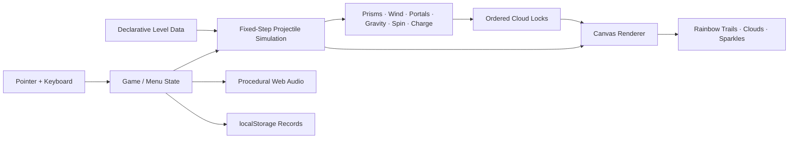

# 🦄🌈 uniRico

<p align="center">
  
</p>

<p align="center">
  <strong>A 13KB rainbow-ricochet puzzle game about a magical unicorn, grumpy storm clouds, and fixing the sky one impossible shot at a time.</strong>
</p>

<p align="center">
  <strong>THE SKY GOT GRUMPY · YOU HAVE A HORN · FIX IT</strong>
</p>

<p align="center">
  Built for <strong>js13kGames 2026</strong> · Theme: <strong>Unicorns and Rainbows</strong> · Target category: <strong>Desktop</strong>
</p>

---

## ✨ What is uniRico?

**uniRico** is a compact HTML5 Canvas puzzle game where you aim a unicorn's horn and fire a fading rainbow through a magical sky.

The shot can ricochet from prisms, pass through rainbow arches, bend in wind, curve around moonbow gravity fields, pick up spin or charge, and interact with other magical effects. Each level contains **angry gray storm clouds** that must be reached in the correct order and with the correct number of bounces. Hit them correctly and the rainbow cheers them up, turning them into happy white clouds.

> **Aim horn → fire rainbow → bend the trajectory → cheer up the clouds.**

The presentation is deliberately cute. The puzzle system underneath it is not. Later levels combine moving geometry, timing windows, portals, continuous forces, persistent projectile state, and exact reflection counts into long-form trajectory problems.

---

## 🎮 The play loop

1. **Aim the horn** with the mouse or pointer.
2. **Read the white trajectory preview** and moving sky systems.
3. **Fire the rainbow** and commit to the shot.
4. **Ricochet through prisms, arches, wind, gravity, spin, and magic.**
5. **Reach each grumpy cloud with exactly the required bounce count.**
6. **Turn it happy** and continue the sequence until the sky is restored.

A successful shot is both the solution and the spectacle: the projectile leaves a fading multi-band rainbow ribbon across the level.

---

## 🌈 Current release: v0.3.0

The current game contains:

- **40 handcrafted puzzle levels**
- a procedural Canvas-drawn unicorn launcher
- a six-band rainbow projectile with a fading ribbon tail
- angry storm-cloud targets that become happy when cleared
- exact-bounce target logic
- moving targets and moving reflectors
- rainbow-arch portals
- wind / cloud-gust fields
- dream-cloud slow zones
- stardust acceleration zones
- moonbow gravity fields
- spin and magnetic charge mechanics
- pulsing storm barriers
- aurora resonance gates
- procedural particles, sparkles, clouds, rainbows, and audio
- local best scores, stars, shots, and completion records
- level select and familiar navigation
- built-in help: **Show Aim**, **Watch Mirrored Shot**, and **Watch Solution**
- no external runtime libraries or downloaded game assets

The competition-oriented runtime remains a single self-contained `index.html`.

---

## 🕹 Controls

| Input | Action |
|---|---|
| Mouse / pointer | Aim the unicorn horn |
| Click / tap | Fire the rainbow |
| `M` / `Esc` | Pause / menu |
| `R` | Restart level |
| `H` | Help |
| `P` | Toggle trajectory preview |
| `S` | Toggle sound |
| `[` / `]` | Previous / next level during development/testing |
| `Space` / `Enter` | Continue after level completion |

---

## ☁️ The theme is the game language

The goal was not to put unicorn art on top of an unrelated physics game. The mechanics themselves are translated into one coherent sky-magic vocabulary.

| Gameplay function | uniRico presentation |
|---|---|
| Launcher | Unicorn + glowing horn |
| Projectile | Fading six-band rainbow |
| Targets | Grumpy storm clouds → happy clouds |
| Reflectors | Rainbow-edged prisms |
| Portals | Rainbow arches |
| Wind | Cloud gusts / magical air currents |
| Slow fields | Dream clouds |
| Acceleration | Stardust / sunburst magic |
| Gravity | Moonbow fields |
| Spin | Swirling unicorn magic |
| Charge / polarity | Magical charge fields |
| Timed barriers | Storm walls / lightning |
| Resonance | Aurora gates |
| Failure hazards | Dark storm-cloud / night-sky hazards |
| Prediction | Bright white dotted trajectory |
| Committed shot | Rainbow ribbon |
| Learned solution | Faint solution trace |

That makes the theme part of how the player reads the puzzle rather than decoration layered on afterward.

---

## 🧠 Puzzle design

Every active cloud encodes a required bounce count. The shot must reach it with **exactly** that number of reflections before the ordered sequence can advance.

The campaign then composes that rule with other systems:

- **moving geometry** asks where an object *will be*, not where it is now;
- **wind and gravity** convert straight-line aiming into continuous trajectory shaping;
- **spin and polarity** create state that persists across the shot;
- **portals** break local spatial intuition and create long routes;
- **timed barriers and resonance gates** make arrival time and speed part of the answer;
- **shorter late-game previews** force the player to reason beyond what the guide explicitly shows.

The intended difficulty curve starts with readable one-idea puzzles and ends with compact little sky-machines that the player learns to decode.

---

# 🔍 Two views of the same game

A size-constrained competition artifact and a good public codebase have different needs. This repository deliberately supports both.

## 1. `index.html` — byte-conscious runtime

The root build keeps HTML, CSS, JavaScript, level data, rendering, audio, and UI together so it can compress efficiently for the js13k archive.

## 2. `src/` — readable development mirror

The same v0.3.0 systems are split into inspectable source files:

```text
src/
├── README.md
├── index.html
├── style.css
├── levels.js
└── runtime/
    ├── core.js
    ├── physics.js
    ├── render-world.js
    ├── render-entities.js
    ├── render-hud.js
    └── ui.js
```

The readable mirror preserves some compact identifiers where changing them would make comparison with the shipping artifact harder. [`docs/SOURCE_GUIDE.md`](docs/SOURCE_GUIDE.md) provides the descriptive symbol map, level-key reference, data shapes, execution flow, and “where do I edit this?” guide.

### Recommended reading order

1. [`docs/SOURCE_GUIDE.md`](docs/SOURCE_GUIDE.md)
2. [`src/levels.js`](src/levels.js)
3. [`src/runtime/core.js`](src/runtime/core.js)
4. [`src/runtime/physics.js`](src/runtime/physics.js)
5. [`src/runtime/render-world.js`](src/runtime/render-world.js)
6. [`src/runtime/render-entities.js`](src/runtime/render-entities.js)
7. [`src/runtime/render-hud.js`](src/runtime/render-hud.js)
8. [`src/runtime/ui.js`](src/runtime/ui.js)
9. [`docs/ARCHITECTURE.md`](docs/ARCHITECTURE.md)
10. [`index.html`](index.html) when you want to see the compressed competition-oriented form

---

## 🗂 Repository map

```text
uniRico/
├── index.html                         # Complete playable v0.3.0 runtime
├── README.md                          # Project showcase + entry point
├── CHANGELOG.md                       # Release / repository history
├── .gitignore
├── src/
│   ├── README.md                      # How to read and run the source mirror
│   ├── index.html                     # Readable development shell
│   ├── style.css                      # Extracted HUD / page styling
│   ├── levels.js                      # Campaign + reusable field rigs
│   └── runtime/
│       ├── core.js                    # State, motion, records, audio
│       ├── physics.js                 # Projectile simulation and targets
│       ├── render-world.js            # Environment / mechanic rendering
│       ├── render-entities.js         # Unicorn, clouds, trails, particles
│       ├── render-hud.js              # HUD, menus, help, level select
│       └── ui.js                      # Frame loop and input state machine
└── docs/
    ├── banner.svg                     # 3:1 README cover banner
    ├── SOURCE_GUIDE.md                # Symbol map + reading guide
    ├── ARCHITECTURE.md                # Systems / engine walkthrough
    └── COMPETITION_CHECKLIST.md       # Release and submission gate
```

---

## 🧬 Architecture at a glance



The important implementation choices are:

- **960 × 600 logical world** scaled into the browser window
- **fixed simulation steps** independent of render cadence
- **one physics path** shared by the live projectile and trajectory prediction
- **declarative level objects** where absent arrays mean absent mechanics
- **shared field rigs** reused by advanced levels to save bytes
- **procedural Canvas art** instead of sprite assets
- **procedural Web Audio** instead of audio files
- **packed solution data** for hints and demonstrations

For the detailed rationale, see [`docs/ARCHITECTURE.md`](docs/ARCHITECTURE.md).

---

## 🧩 Compact level format

A level is a small object with recurring keys:

| Key | Meaning |
|---|---|
| `n` | level name |
| `p` | unicorn start position |
| `t` | ordered cloud targets |
| `m` | reflection limit |
| `q` | trajectory-preview simulation budget |
| `w` | reflective walls / prisms |
| `o` | rainbow-arch portals |
| `f` | wind fields |
| `z` | dream-cloud slow zones |
| `a` | accelerator zones |
| `g` | gravity / moonbow fields |
| `s` | spin fields |
| `c` | charge zones |
| `k` | polarity / magnetic fields |
| `b` | timed storm barriers |
| `r` | resonance gates |
| `v` | hazards |

A cloud target uses:

```text
[x, y, requiredBounces, motionMode, amplitude, speed, phase, radius]
```

Later levels spread reusable `F0...F9` field rigs into the level object. That is one of the main ways the campaign becomes mechanically dense without restating the same environment data over and over.

---

## 🧵 Trace one shot through the source

A useful way to learn the code is to follow a single click:

```text
pointer aim
   ↓
$U / $3          input + fire
   ↓
$i               construct projectile
   ↓
$Q               fixed simulation update
   ↓
$7               advance live shot / target progression
   ↓
_f               one physics tick
   ↓
Z / _e / $O ...  reflections, walls, portals, fields
   ↓
$C               draw fading rainbow ribbon
   ↓
win / $4         complete or fail
```

The compact names are mapped to descriptive meanings in [`docs/SOURCE_GUIDE.md`](docs/SOURCE_GUIDE.md). The source is much easier to understand once that one lifecycle is clear.

---

## 🚀 Running locally

### Competition-style build

No install step is required. Open `index.html`, or serve the repository:

```bash
python3 -m http.server 8000
```

Then open:

```text
http://localhost:8000/
```

### Readable development mirror

With the same server running, open:

```text
http://localhost:8000/src/
```

The development shell loads the readable source in dependency order:

```text
levels.js
runtime/core.js
runtime/physics.js
runtime/render-world.js
runtime/render-entities.js
runtime/render-hud.js
runtime/ui.js
```

That makes the systems easier to inspect directly in browser developer tools without introducing a framework or build dependency.

---

## 📦 js13k size checkpoint

The standard archive ceiling is **13 KiB = 13,312 bytes**.

The locally frozen v0.3.0 competition archive currently measures:

```text
13,155 bytes
157 bytes remaining
SHA-256: 1588b481c786939a99dd360409b42eb425889cec1b04fc52ba66acf7b9c5264e
```

The exact submission ZIP is kept separate from the readable repository tree. When the final Desktop candidate is frozen, it should be attached to a tagged release so the source commit, ZIP artifact, byte count, and hash form one reproducible checkpoint.

See [`docs/COMPETITION_CHECKLIST.md`](docs/COMPETITION_CHECKLIST.md).

---

## 🧪 Release gate

Before a competition build is frozen, the candidate should pass:

1. exact ZIP byte-count check
2. `index.html` at archive root
3. offline / no-external-runtime-resource check
4. latest Chrome smoke test
5. latest Firefox smoke test
6. zero console errors
7. early-, middle-, and late-campaign gameplay checks
8. pause / Help / Levels / Restart checks
9. solution playback check
10. local record persistence check
11. resize and multiple desktop aspect-ratio checks
12. readable-source mirror review
13. SHA-256 freeze of the exact submitted archive

The expanded gate lives in [`docs/COMPETITION_CHECKLIST.md`](docs/COMPETITION_CHECKLIST.md).

---

## 🎨 Visual design principles

uniRico aims for **cute clarity rather than decorative overload**:

- the twilight-blue playfield keeps white prediction lines readable;
- pale cloud-shaped HUD panels separate information from the arena;
- rainbow saturation is concentrated around motion, interaction, and success;
- grumpy gray clouds communicate unresolved objectives immediately;
- happy white clouds make restoration emotionally obvious;
- environmental systems remain distinguishable even when several overlap;
- menus use familiar words such as **Levels**, **Help**, and **Restart Level** even when the world itself is whimsical.

The player should be solving the puzzle, not solving the interface.

---

## 🏆 Built for js13kGames 2026

uniRico is being developed for the **Desktop** category of **js13kGames 2026**, themed **Unicorns and Rainbows**.

Competition site: `https://js13kgames.com/2026/`

The tiny build is the constraint. **This repository is the explanation.**

---

<p align="center">
  🦄 <strong>Aim the horn. Bend the rainbow. Fix the sky.</strong> 🌈
</p>
