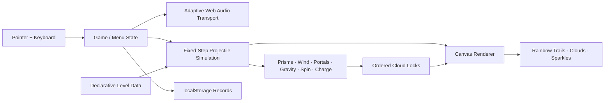

# 🦄🌈 uniRico

<p align="center">
  
</p>

<p align="center">
  <strong>A 13KB rainbow-ricochet puzzle game about a magical unicorn, grumpy storm clouds, impossible trajectories, and a procedurally synthesized bass soundtrack.</strong>
</p>

<p align="center">
  <strong>THE SKY GOT GRUMPY · YOU HAVE A HORN · FIX IT</strong>
</p>

<p align="center">
  Built for <strong>js13kGames 2026</strong> · Theme: <strong>Unicorns and Rainbows</strong> · Target category: <strong>Desktop</strong>
</p>

---

## ✨ What is uniRico?

**uniRico** is a precision HTML5 Canvas puzzle game where a tiny unicorn fires a rainbow through a magical sky. The rainbow can ricochet from moving prisms, bend through wind and gravity, pass through rainbow arches, inherit spin or charge, cross timing gates, and thread ordered cloud locks.

> **Aim horn → fire rainbow → bend the trajectory → cheer up the clouds.**

The presentation is cute. The simulation underneath it becomes a compact little machine. Later levels ask the player to reason about moving geometry, portal timing, persistent projectile state, exact bounce counts, and interacting force fields while the soundtrack changes with the state of the shot.

---

## 🔊 Current release: v0.8.0

v0.8.0 is the current public candidate and combines the gameplay reliability work from v0.4.x with the procedural music system developed through v0.5–v0.8.

### State-aware bass music

The soundtrack is synthesized entirely with Web Audio. There are no samples, music files, external synths, or network requests.

**Aiming is quicker and funkier.** The planning state moves across roughly **122–138 BPM** before swing, using syncopated filtered bass pops, pitched triangle stabs, off-beat hats, and lighter ghost-snare punctuation.

**A live rainbow shot drops into heavier musical slow motion.** Flight moves across roughly **94–106 BPM** before bounce-dependent slowdown. The arrangement becomes denser rather than faster: deeper sub, wobble bass, harder kicks, layered snares, syncopated melodic answers, irregular hats, and phrase-end transitions.

Every bar has its own base tempo, alternating sixteenth notes receive about 12% swing, and additional reflections slightly slow the flight groove. The result is a soundtrack that breathes with the play loop instead of sitting behind it as a fixed metronome.

### Reliable cloud locks and moving prisms

Two collision problems found during playtesting are now handled explicitly:

- **Cloud tunneling:** fast shots use swept relative-motion contact against moving targets instead of endpoint-only sampling.
- **Moving-wall dragging:** moving prisms use swept point-vs-expanded-AABB collision in the wall's moving frame, reflect only the collision-axis velocity, and separate the projectile just outside the contacted face.

Future clouds struck out of order now fail with explicit `WRONG CLOUD · NEXT N` feedback rather than silently ignoring the contact.

### Stronger objective readability

Unresolved dark clouds have bright white silhouettes against the warmer blue-violet sky. The active cloud gets a stronger halo, numbered badge, `NEXT` label, direct bounce requirement, and a dotted connector toward the following unresolved target. The HUD repeats the current order and bounce requirement.

### A smoother 40-level difficulty curve

Levels 1–19 introduce individual systems. Levels 20–30 now form a deliberate mixed-mechanic bridge with larger targets and longer prediction windows before Levels 31–40 return to the dense endgame chains.

---

## 🎮 Controls

| Input | Action |
|---|---|
| Mouse / pointer | Aim the unicorn horn |
| Click / tap | Fire the rainbow |
| `M` / `Esc` | Pause / menu |
| `R` | Restart level |
| `H` | Help |
| `P` | Toggle trajectory preview |
| `S` | Toggle soundtrack + SFX |
| `[` / `]` | Previous / next level during development/testing |
| `Space` / `Enter` | Continue after level completion |

---

## ☁️ The theme is the game language

The goal is not to paste unicorn art over an unrelated physics game. The mechanics themselves are translated into one sky-magic vocabulary.

| Gameplay function | uniRico presentation |
|---|---|
| Launcher | Unicorn + glowing horn |
| Projectile | Fading six-band rainbow |
| Ordered targets | Grumpy storm clouds → happy clouds |
| Reflectors | Rainbow-edged prisms |
| Portals | Rainbow arches |
| Wind | Cloud gusts / magical currents |
| Slow fields | Dream clouds |
| Acceleration | Stardust / sunburst magic |
| Gravity | Moonbow fields |
| Spin | Swirling unicorn magic |
| Charge / polarity | Magical charge fields |
| Timed barriers | Storm walls / lightning |
| Resonance | Aurora gates |
| Hazards | Dark storm-cloud / night-sky cores |
| Prediction | Bright white dotted trajectory |
| Live shot | Rainbow ribbon |
| Learned solution | Faint solution trace |

---

## 🧠 Puzzle architecture

Every active target contains a required bounce count. A shot only advances the ordered sequence when it reaches the active cloud with exactly that number of reflections.

The campaign composes this rule with shared systems rather than writing unique logic for every level. One periodic-motion primitive can animate targets, prisms, and portal endpoints. One projectile step powers both the real rainbow and the trajectory predictor. Reusable `F0...F9` field rigs let the late campaign combine many mechanics without repeating environment data.

A target tuple is:

```text
[x, y, requiredBounces, motionMode, amplitude, speed, phase, radius]
```

Common level keys include `w` walls, `o` portals, `f` wind, `z` slow zones, `a` accelerators, `g` gravity, `s` spin, `c` charge, `k` polarity, `b` barriers, `r` resonance gates, and `v` hazards.

---

## 🔍 Readable source and exact competition artifact

The repository deliberately exposes two forms of the game.

### Human-readable runtime

The root page and `src/` load the v0.8.0 runtime as separate classic scripts:

```text
src/
├── levels.js
├── style.css
└── runtime/
    ├── core.js
    ├── audio.js
    ├── physics.js
    ├── render-world.js
    ├── render-entities.js
    ├── render-hud.js
    └── ui.js
```

This is the version to study and modify.

### Byte-conscious competition artifact

The js13k candidate remains a separate frozen one-file ZIP rather than being mixed into the readable source tree. The public repository records the exact byte count and SHA-256 below, while the final uploaded archive should be attached to a tagged GitHub Release once the competition candidate is frozen.

That keeps the repository focused:

```text
src/            learnable implementation
tests/          behavioral regressions
docs/           architecture and release notes
index.html      readable browser entry point
```

---

## 🧬 Runtime map



The trajectory preview uses the same projectile physics path as the live shot, which is essential for a game where the player is making decisions from predicted motion.

---

## 🚀 Run locally

No package manager or build framework is needed for development play:

```bash
python3 -m http.server 8000
```

Open:

```text
http://localhost:8000/
```

The readable development shell is also available at:

```text
http://localhost:8000/src/
```

---

## 🧪 Regression suite

The release source includes three focused Node tests:

```bash
node tests/solution-smoke.js
node tests/moving-wall-collision.js
node tests/audio-sequencer.js
```

The current v0.8.0 source passes:

- **40/40 encoded solution trajectories**
- moving-prism swept-collision regressions
- aim-state vs. flight-state tempo inversion
- swing and bar-level timing variation
- bass/sub/high-frequency synthesis coverage
- finite oscillator start/stop lifecycle
- soundtrack mute gating

Final human Chrome and Firefox playtesting of the exact frozen ZIP remains a separate submission gate.

---

## 📦 js13k size checkpoint

The locally frozen v0.8.0 competition candidate currently measures:

```text
HTML:   35,324 bytes
ZIP:    13,272 / 13,312 bytes
Free:   40 bytes
SHA256: e08b939e78159dfd9288becb0aec273c96d8af896df46e6118ad2fd073847e2e
```

---

## 📚 Learn from the code

Recommended reading order:

1. [`docs/SOURCE_GUIDE.md`](docs/SOURCE_GUIDE.md)
2. [`src/levels.js`](src/levels.js)
3. [`src/runtime/core.js`](src/runtime/core.js)
4. [`src/runtime/audio.js`](src/runtime/audio.js)
5. [`src/runtime/physics.js`](src/runtime/physics.js)
6. rendering modules under `src/runtime/`
7. [`docs/ARCHITECTURE.md`](docs/ARCHITECTURE.md)
8. the frozen one-file competition artifact only after the readable version makes sense

---

## 🏆 Built for js13kGames 2026

uniRico is being developed for the **Desktop** category of **js13kGames 2026**, themed **Unicorns and Rainbows**.

The tiny build is the constraint. **This repository is the explanation.**

---

<p align="center">
  🦄 <strong>Aim the horn. Bend the rainbow. Fix the sky.</strong> 🌈
</p>
