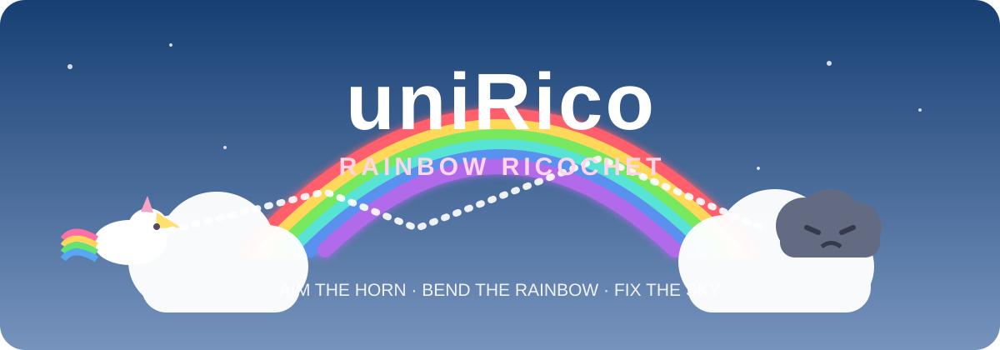

# 🦄🌈 uniRico v0.17.0

<p align="center">
  
</p>

<p align="center">
  <strong>A 13KB rainbow-ricochet puzzle game where a magical unicorn bends rainbows through prisms, portals, wind, gravity, spin, polarity, and grumpy clouds.</strong>
</p>

<p align="center"><strong>THE SKY GOT GRUMPY · YOU HAVE A HORN · FIX IT</strong></p>

Built for **js13kGames 2026** around the theme **Unicorns and Rainbows**.

## v0.17.0 — Bottom Rules Ribbon

The cloud-language legend now sits at the bottom of the opening menu in a high-contrast **dark rainbow ribbon**. `PLAY · LEVEL` and `LEVELS` return to the visual center of the screen, so onboarding supports the menu hierarchy instead of interrupting it.

The rules themselves are unchanged: **white ring = current cloud, number inside = order, number above = exact bounce count**. The card is intentionally prominent only on the menu and disappears entirely during play.

## v0.16.0 — Learn the cloud language before the first shot

The opening menu includes one compact visual rules card using the exact target grammar seen in play:

- **white ring** → this is the current cloud
- **number inside the cloud** → hit order
- **number above the cloud** → exact wall/prism bounces required before impact

The example is deliberately visual rather than another tutorial page. Once Play is pressed, it disappears and the live HUD remains timer-only.

## v0.15.0 — Ring Language

v0.15 removes the last word-heavy objective labels from active play and moves the puzzle language directly onto the clouds.

- The persistent top HUD now shows **only the live timer**.
- The **single white ring** is the only indicator for the currently active cloud.
- Each cloud's **sequence number is printed directly into the top of the cloud**. Unresolved gray clouds use white numbering; restored white clouds switch to a dark number for contrast.
- The small circular badge above each unresolved cloud now shows the **required bounce count only**.
- The old `NEXT X/X · NEED X BOUNCES`, `NEXT`, and bottom `N BOUNCES` labels are removed from the playfield.

The result is a compact visual grammar: **ring = active target, number on cloud = order, number above cloud = reflections required**.

## v0.14.0 — Mechanic Echoes

v0.13 made every visible mechanic matter. v0.14 makes that rule **legible while you play**.

The temporary level card names the actual systems present in that puzzle, for example:

```text
LEVEL 20 · FIRST MIX
PRISM · WIND · SPIN
```

That vocabulary is generated directly from level data, so the title card doubles as a compact pre-flight briefing without adding permanent HUD clutter. Moving-target lessons identify `MOVING CLOUD`; levels with multiple systems expose the exact mechanic set before the card fades away.

### Reactive mechanic echoes

The first time a live rainbow activates a mechanic during a shot, the game answers with a brief floating label, a five-spark burst, and a tiny pitched triangle blip. `WIND`, `SPIN`, `MOON`, `CHARGE`, `MAGNET`, `AURORA`, `ARCH`, `PRISM`, and the other systems therefore announce themselves **at the moment cause becomes effect**.

Each mechanic can echo only once per shot, so later levels do not become a cloud of repeated labels. Prediction and Help simulations suppress these effects entirely, preserving deterministic physics and preventing fake tutorial feedback.

### Perfect Path

Completing a level on the first shot earns a small presentation reward: the result card reads **PERFECT PATH!** and the completion chime resolves higher. It adds satisfaction without changing scoring, physics, or the campaign solution space.

## v0.13.0 foundation — mechanic-driven campaign

The entire 40-level campaign has been re-audited around one rule:

> **If an interactive object is visible in a level, the intended solution must use it or it must act as required gate geometry.**

Earlier builds occasionally presented an intimidating collection of fields that a lucky direct bank shot could ignore. Level 20 exposed the problem most clearly. v0.13.0 removes that ambiguity. Decorative mechanics were pruned, important fields were repositioned or strengthened, and cloud locks were rebuilt along mechanic-dependent trajectories.

### Level 20 is now an actual mixed-system puzzle

`20 · FIRST MIX` requires the player to route through **spin + wind + prism reflection** in one ordered two-cloud chain. Broad aim sweeps and timing variations were audited to reject winning routes that bypass any of those systems.

### Difficulty now has an explicit curriculum

| Levels | Design goal | Ordered locks | Assistance pressure |
|---|---|---:|---|
| 1–8 | learn one fundamental at a time | 1 | longest trajectory preview |
| 9–15 | moving/timed/linked mechanic lessons | 1–2 | gradually shorter preview |
| 16–19 | first real combinations | 2–3 | precision begins to matter |
| 20–25 | two-lock mixed-system bridge | 2 | every displayed system is required |
| 26–30 | multi-system chains | 3 | smaller targets + shorter preview |
| 31–35 | advanced chains | 4 | 9px lock radii |
| 36–39 | endgame sequences | 5 | 7px lock radii |
| 40 | `FULL SPECTRUM` | 6 | 6px locks + seven interacting systems |

The trajectory-preview budget is **monotonically non-increasing from Level 1 to Level 40**.

## What the campaign teaches

- boundary and prism ricochets
- moving prisms
- timed storm barriers
- rainbow-arch portals
- wind fields
- dream-cloud slow zones
- stardust acceleration
- moonbow gravity
- persistent spin
- charge + magnetic polarity
- resonance / speed gates
- ordered cloud locks with exact bounce requirements

## Mechanic-use invariant

`tests/mechanic-coverage.js` executes the encoded intended solution for every level and records which interactive instances are actually touched or traversed. The test fails when a visible mechanic becomes unused.

Three full-height walls are intentionally treated as **portal gate geometry** rather than impact surfaces. In Levels 3, 13, and 15 they prevent crossing the arena normally, making the portal itself mandatory.

## Live presentation

During active play the top HUD deliberately contains only the timer:

```text
00:08.6
```

Target information is carried by the arena itself: a white ring marks the active cloud, the cloud body carries its order number, and the small badge above it carries the bounce requirement. At level start, the level name and mechanic briefing appear in a bold bottom-centered card for roughly 3.5 seconds, then fade away. Campaign totals and shot statistics live on pause/menu/completion screens instead of covering puzzle geometry.

## Music

The soundtrack is generated entirely with Web Audio.

- **Planning:** slower orchestral-style harmonic bed with overlapping sine/triangle voices.
- **Shot in flight:** procedural Wobble Warfare dubstep with clean sub, wobble/formant bass, yoi responses, sharp half-time snare, irregular kicks, hats, risers, growls, swing, and phrase transitions.

No audio files or external runtime assets are used.

## Controls

| Input | Action |
|---|---|
| Mouse / pointer | Aim |
| Click / tap | Fire |
| `M` / `Esc` | Pause / menu |
| `R` | Restart level |
| `H` | Help |
| `P` | Toggle trajectory preview |
| `S` | Toggle music + SFX |
| `[` / `]` | Previous / next level during development |
| `Space` / `Enter` | Continue after completion |

## Repository layout

```text
uniRico/
├── index.html
├── README.md
├── CHANGELOG.md
├── src/
│   ├── index.html
│   ├── style.css
│   ├── levels.js
│   └── runtime/
│       ├── core.js
│       ├── audio.js
│       ├── physics.js
│       ├── render-world.js
│       ├── render-entities.js
│       ├── render-hud.js
│       └── ui.js
├── tests/
│   ├── solution-smoke.js
│   ├── mechanic-coverage.js
│   ├── mechanic-feedback.js
│   ├── target-language.js
│   ├── menu-rules.js
│   ├── moving-wall-collision.js
│   ├── audio-sequencer.js
│   ├── module-load.js
│   └── hud-layout.js
├── tools/
│   └── build_js13k_zip.py
└── docs/
    ├── banner.svg
    ├── SOURCE_GUIDE.md
    ├── ARCHITECTURE.md
    └── COMPETITION_CHECKLIST.md
```

## Wavedash deployment

The GitHub root entrypoint keeps a guarded Wavedash readiness handshake. The deployment workflow produces `dist/uniRico-v0.17.0-wavedash.zip`, while the js13k one-file candidate remains platform-neutral.

## Running locally

```bash
python3 -m http.server 8000
```

Readable modular build:

```text
http://localhost:8000/src/
```

## Validation

v0.17.0 is covered by automated and design-audit checks for:

- **40/40 encoded solutions truly complete every ordered target**
- every visible mechanic instance is traversed/collided with by the intended route, except explicitly documented portal gates
- preview assistance never increases as the campaign advances
- swept moving-cloud collision
- swept moving-prism collision and moving-frame reflection
- anti-sticking post-impact separation
- orchestral-to-dubstep audio state switching
- oscillator cleanup / mute gating
- timer-only HUD, transient bottom title card, and target-language regression
- dark bottom onboarding ribbon + centered menu control regression
- generated mechanic legends and one-shot interaction echoes
- mechanic-feedback suppression during simulation
- JavaScript syntax across readable modules
- exact one-file ZIP structure and integrity

A final human pass in **current Chrome + current Firefox** remains the last release gate before official submission.

## Current js13k candidate

```text
12,858 / 13,312 bytes
454 bytes remaining
SHA-256: d091e34bdab99da90f2143977a13904dfbc956cb846777ac41438b36826b4e09
```

v0.17 spends part of the recovered byte budget on clearer first-run presentation while preserving the minimal in-level interface.

## Engineering idea

uniRico's complexity comes from composition:

- one fixed-step simulation powers both live shots and prediction;
- one motion primitive animates targets, prisms, and portal endpoints;
- reusable field rigs build advanced levels cheaply;
- procedural Canvas replaces sprites;
- procedural Web Audio replaces music assets;
- compact tuples encode a full 40-level campaign;
- regression tests protect the weird edge cases that emerge when all of those systems interact.

<p align="center">🦄 <strong>Aim the horn. Bend the rainbow. Fix the sky.</strong> 🌈</p>
